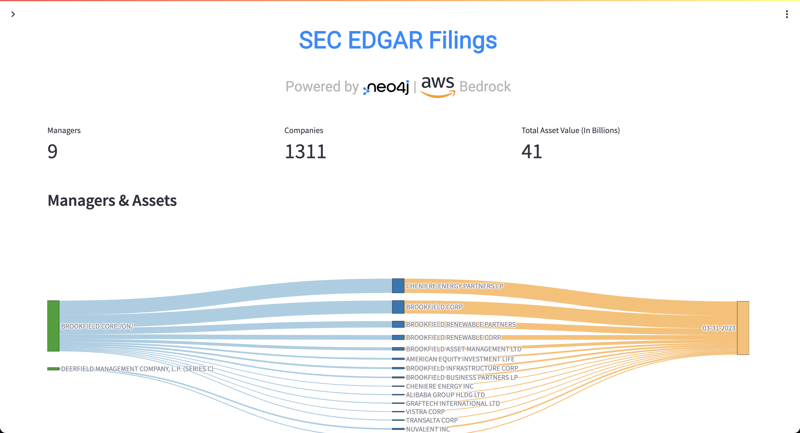
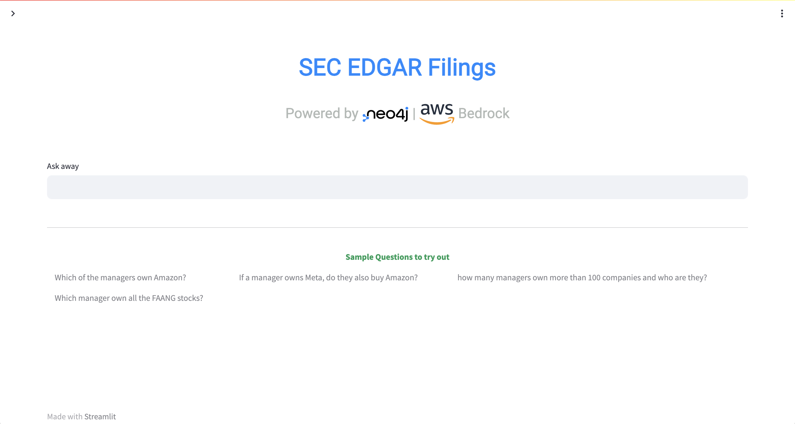

# neo4j-generative-ai-aws
This is a sample notebook and web application which shows how Amazon Bedrock and Titan can be used with Neo4j. We will explore how to leverage generative AI to build and consume a knowledge graph in Neo4j.

The dataset we're using is from the SEC's EDGAR system.  It was downloaded using [these scripts](https://github.com/neo4j-partners/neo4j-sec-edgar-form13).

The dataflow in this demo consists of two parts:
1. Ingestion - we read the EDGAR files with Bedrock, extracting entities and relationships from them which is then ingested into a Neo4j database deployed from [AWS Marketplace](https://aws.amazon.com/marketplace/pp/prodview-akmzjikgawgn4).
2. Consumption - A user inputs natural language into a chat UI.  Bedrock converts that to Neo4j Cypher which is run against the database.  This flow allows non technical users to query the database.

## Setup Sagemaker Studio Environment
To get started setting up the demo, clone this repo into a [SageMaker Studio](https://aws.amazon.com/sagemaker/studio/) environment and then run through the notebooks numbered 1 and 2.

## Deploy Neo4j AuraDS Professional
This demo requires a Neo4j instance.  You can deploy that using the AWS Marketplace listing [here](https://aws.amazon.com/marketplace/pp/prodview-2t3o7mnw5ypee).

## Enable AWS IAM permissions for Bedrock
The AWS identity you assume from your notebook environment (which is the [*Studio/notebook Execution Role*](https://docs.aws.amazon.com/sagemaker/latest/dg/sagemaker-roles.html) from SageMaker, or could be a role or IAM User for self-managed notebooks), must have sufficient [AWS IAM permissions](https://docs.aws.amazon.com/IAM/latest/UserGuide/access_policies.html) to call the Amazon Bedrock service.

To grant Bedrock access to your identity, you can:

- Open the [AWS IAM Console](https://us-east-1.console.aws.amazon.com/iam/home?#)
- Find your [Role](https://us-east-1.console.aws.amazon.com/iamv2/home?#/roles) (if using SageMaker or otherwise assuming an IAM Role), or else [User](https://us-east-1.console.aws.amazon.com/iamv2/home?#/users)
- Select *Add Permissions > Create Inline Policy* to attach new inline permissions, open the *JSON* editor and paste in the below example policy:

```
{
    "Version": "2012-10-17",
    "Statement": [
        {
            "Sid": "BedrockFullAccess",
            "Effect": "Allow",
            "Action": ["bedrock:*"],
            "Resource": "*"
        }
    ]
}
```

> ⚠️ **Note:** With Amazon SageMaker, your notebook execution role will typically be *separate* from the user or role that you log in to the AWS Console with. If you'd like to explore the AWS Console for Amazon Bedrock, you'll need to grant permissions to your Console user/role too.

For more information on the fine-grained action and resource permissions in Bedrock, check out the Bedrock Developer Guide.

## UI
The UI application is based on Streamlit. In this example we're going to show how to run it on an [AWS EC2 Instance (EC2)](https://console.aws.amazon.com/ec2/) VM.  First, deploy a VM. You can use [this guide to spin off an Amazon Linux VM](https://docs.aws.amazon.com/AWSEC2/latest/UserGuide/EC2_GetStarted.html)

We are going to use AWS CLI. You need to [follow these steps](https://docs.aws.amazon.com/cli/latest/userguide/cli-authentication-short-term.html) to configure the credentials to use the CLI option 

Login using AWS credentials via the `aws` cli.

    aws configure
        

Next, login to the new VM instance using AWS CLI:

    export INSTANCE_ID=<YOUR_EC2_INSTANCE_ID>
    aws ec2-instance-connect ssh --instance-id $INSTANCE_ID

We're going to be running the application on port 80.  That requires root access, so first:

    sudo su

Then you'll need to install git and clone this repo:

    yum install -y git
    mkdir -p /app
    cd /app
    git clone https://github.com/neo4j-partners/neo4j-generative-ai-aws.git
    cd neo4j-generative-ai-aws

Let's install python & pip first:

    yum install -y python
    yum install -y pip

Now, let's create a Virtual Environment to isolate our Python environment and activate it

    yum install -y virtualenv
    python3 -m venv /app/venv/genai
    source /app/venv/genai/bin/activate

To install Streamlit and other dependencies:

    cd ui
    pip install -r requirements.txt

Check if `streamlit` command is accessible from PATH by running this command:

    streamlit --version

If not, you need to add the `streamlit` binary to PATH variable like below:

    export PATH="/app/venv/genai/bin:$PATH"

Next up you'll need to create a secrets file for the app to use.  Open the file and edit it:

    cd streamlit
    cd .streamlit
    cp secrets.toml.example secrets.toml
    vi secrets.toml

You will now need to edit that file to reflect your credentials. The file has the following variables:

    SERVICE_NAME = "" #e.g. bedrock-runtime
    REGION_NAME = "" #e.g. us-west-2
    CYPHER_MODEL = "" #e.g. anthropic.claude-v2
    ACCESS_KEY = "AWS ACCESS KEY" #provide the access key with bedrock access
    SECRET_KEY = "AWS SECRET KEY" #provide the secret key with bedrock access
    NEO4J_HOST = "" #NEO4J_AURA_DS_URL
    NEO4J_PORT = "7687"
    NEO4J_USER = "neo4j"
    NEO4J_PASSWORD = "" #Neo4j password
    NEO4J_DB = "neo4j"

Now we can run the app with the commands:

    cd ..
    streamlit run Home.py --server.port=80

Optionally, you can run the app in another screen session to ensure the app continues to run even if you disconnect from the ec2 instance:

    screen -S run_app
    cd ..
    streamlit run Home.py --server.port=80    

You can use `Ctrl+a` `d` to exit the screen with the app still running and enter back into the screen with `screen -r`. To kill the screen session, use the command `screen -XS run_app quit`.

On the VM to run on port 80:
- Ensure you are a root or has access to run on port 80
- Ensure that the VM has port 80 open for HTTP access. You might need to open that port or any other via firewall rules as mentioned [here](https://repost.aws/knowledge-center/connect-http-https-ec2). 

Once deployed, you will be able to see the Dashboard and Chat UI:

## Dashboard

## Chat UI


From the Chat UI, you can ask questions like:
1. Which of the managers own Amazon?
2. How many managers own more than 100 companies and who are they?
3. Which manager own all the FAANG stocks?

